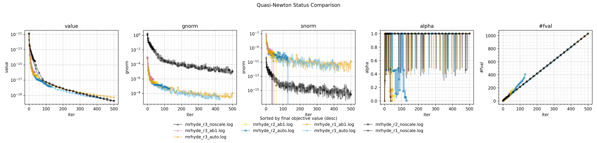
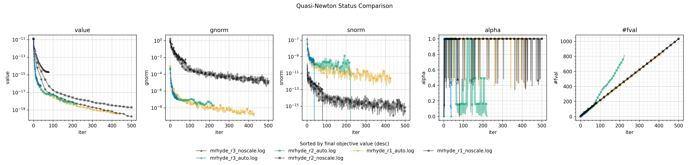

# Maxwell optimal-control: Riesz metric and scaling studies

Most subdirectories compare the same three H(curl) Riesz metric modes:
- `noscale`: Euclidean (no Riesz map).
- `auto`: alpha1, alpha2 auto-scaled so mass and curl-curl stiffness balance.
- `ab1`: alpha1 = alpha2 = 1.

Other variables per subdirectory:

## LBFGS

- [lbfgs_hscale_fixed_Nx_Ny](lbfgs_hscale_fixed_Nx_Ny/): h-refinement on z only (NX=NY=2 fixed, NZ varies).
- [lbfgs_ht_scale](lbfgs_ht_scale/): joint h+t refinement (NZ and nsteps scale together).
- [lbfgs_test](lbfgs_test/): parameter sweeps: `alpha`, `H0_scaling`, `lbfgs_storage`.
- [reg_weight_scan](reg_weight_scan/): objective regularization weights `w_l2` and `w_curl`.

## Trust Region

- [trust_region](trust_region/): fixed mesh; sweeps (alpha1, alpha2) against `no_scale`.
- [trust_region_hscale](trust_region_hscale/): full h-refinement (NX, NY, NZ together; cubical cells).
- [trust_region_hscale_fixed_Nx_Ny](trust_region_hscale_fixed_Nx_Ny/): h-refinement on z only (anisotropic).
## Key results

### h-only refinement ([lbfgs_hscale_fixed_Nx_Ny](lbfgs_hscale_fixed_Nx_Ny/))

### Joint h+t refinement ([lbfgs_ht_scale](lbfgs_ht_scale/))

